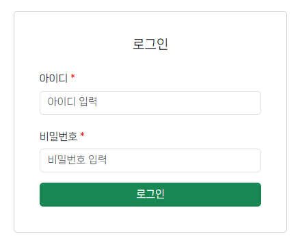
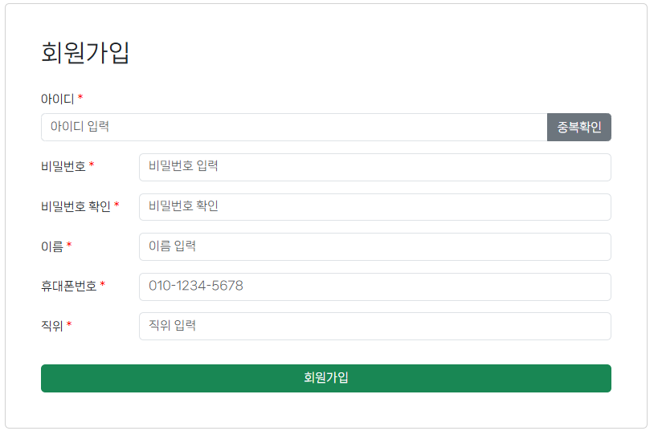
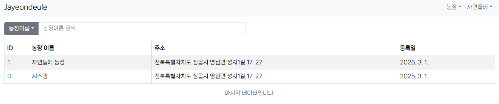
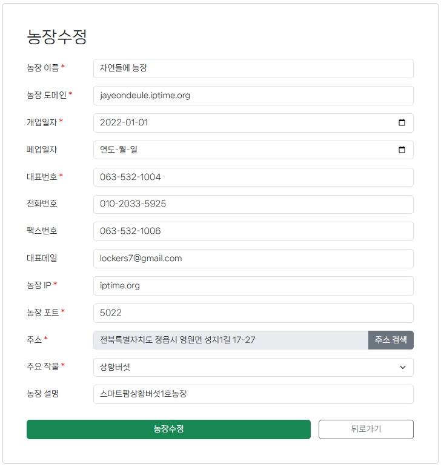
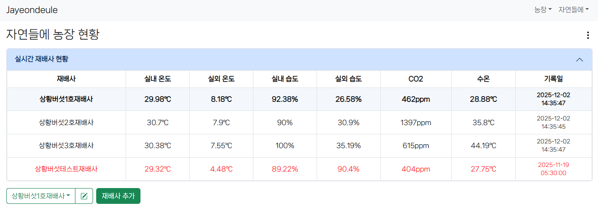
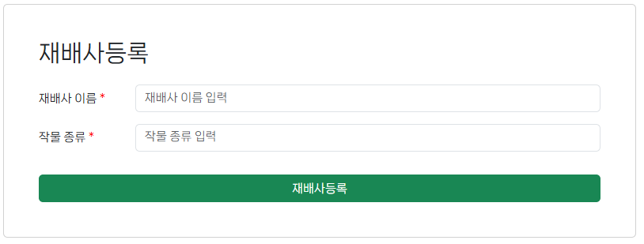
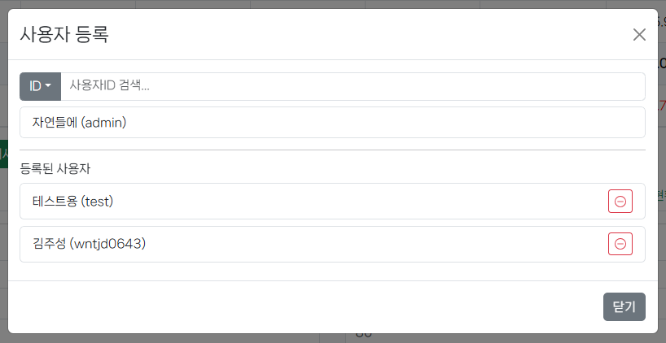
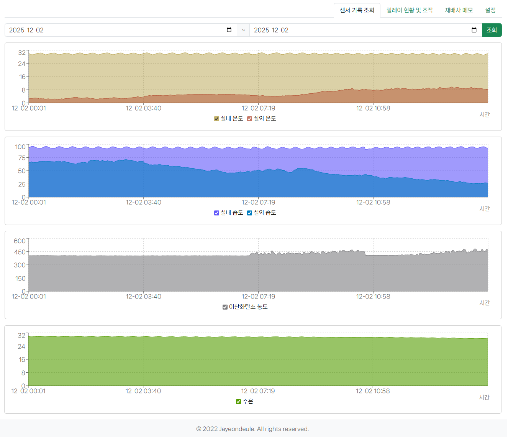

# Jayeondeule_Web_v3
자연들에 스마트팜 관리 웹 프로젝트

## 1. Farm(농장) 관리

### ▷ 농장 등록
- 관리자만 수행 가능
- 새로운 농장을 시스템에 등록
- 농장 이름, 주소, 설명 등의 기본 정보 입력

### ▷ 농장 리스트 조회
- 관리자 전용 기능
- 전체 농장 목록 조회
- 페이지네이션 지원

### ▷ 내 농장 조회
- 로그인한 사용자가 소유한 농장 조회
- 사용자 토큰 기반으로 자동 매핑

### ▷ 특정 농장 조회
- 관리자 또는 해당 농장 소유자만 조회 가능
- Farm ID 기반 단일 조회

### ▷ 농장 정보 수정
- 관리자 또는 해당 농장 소유자가 수정 가능
- 농장 이름, 설명, 이미지 등 업데이트 가능

---

## 2. House(재배사) 관리

### ▷ 하우스 등록
- 사용자가 자신의 농장 아래에 새로운 하우스 생성

### ▷ 하우스 목록 조회
- 사용자가 소유한 농장의 모든 하우스 조회

### ▷ 하우스 상세 조회
- 특정 하우스의 센서, 장치 구성, 배치 정보 조회

### ▷ 하우스 정보 수정
- 하우스 이름/크기/메모 등 수정 가능

### ▷ 하우스 삭제
- 사용자의 하우스를 삭제

---

## 3. Sensor(센서) 관리

### ▷ 센서 데이터 수집
- Raspberry Pi로부터 주기적으로 측정
- 온도, 습도, CO2, 조도 등 센서값 저장

### ▷ 특정 하우스 센서값 조회
- 최근 데이터 기준 단일 하우스 환경 확인

### ▷ 센서 이력 조회
- 날짜 기준 범위 조회
- 그래프용 데이터 제공 API

---

## 4. Relay(장치 제어) 관리

### ▷ 장치 제어 요청
- 난방, 냉방, 관수, 급수 펌프 등 제어
- Raspberry Pi에서 명령을 수행할 수 있도록 DB에 저장

### ▷ 현재 장치 상태 조회
- 제어 장치의 최신 상태 값 반환(ON/OFF)

### ▷ 자동 제어 상태 변경
- 자동 모드 ON/OFF 전환
- 사용자 정의 알고리즘과 연동됨

---

## 5. Memo(메모/일지)

### ▷ 메모 등록
- 하우스 단위로 메모 작성

### ▷ 메모 리스트 조회
- 날짜별 조회
- 최근 작성순/필터 지원

### ▷ 메모 수정 및 삭제
- 사용자 작성 메모 편집/삭제 가능

---

## 6. User(사용자) / Authentication

### ▷ 회원가입
- 이메일, 비밀번호, 닉네임 기반 가입

### ▷ 로그인 / JWT 발급
- 로그인 시 JWT Token 발급 후 API 접근

### ▷ 사용자 정보 조회
- 내 정보 조회
- 내 농장/하우스 자동 연결

### ▷ 비밀번호 변경
- 기존 비밀번호 인증 후 변경

---

## 7. Raspberry Pi 연동

### ▷ 센서 데이터 DB 저장
- Pi → DB
- 센서 데이터 서버와 연동되어있는 DB로 저장

### ▷ 제어 명령 요청 API
- 서버 → DB
- 릴레이 ON/OFF 명령등을 DB로 저장

### ▷ 장치 상태 업데이트
- Pi에서 DB의 최신 상태를 조회하여 릴레이에 반영

---

## 화면 구성

---
### 로그인

### 회원가입

### 농장 목록

### 농장 등록

### 농장 수정

### 농장 현황

### 재배사 등록

### 재배사 수정

### 재배사 사용자 등록

### 재배사 센서 기록 조회

### 재배사 릴레이 현황 및 조작

### 재배사 메모

### 재배사 설정
